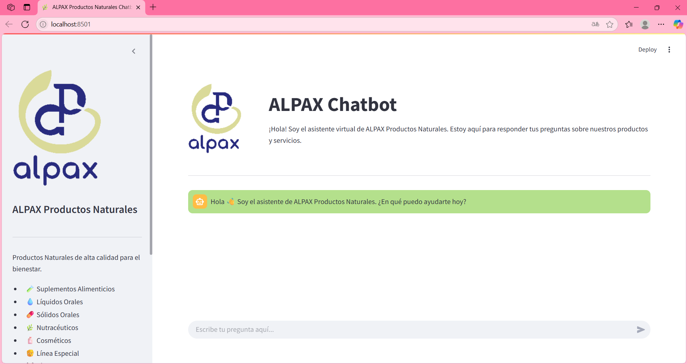

# CamposAguado_ProyectoIA

# 🧠 ALPAX Chatbot - Asistente IA para Productos Naturales

Bienvenido al repositorio oficial del **Chatbot de ALPAX Productos Naturales**, un asistente inteligente diseñado para responder preguntas sobre nuestros suplementos alimenticios, servicios de maquila y líneas de productos.

Este chatbot usa **LLaMA 3 (via Ollama)**, está construido con **Langchain** y tiene un frontend interactivo en **Streamlit** con un diseño personalizado para representar la identidad visual de la empresa.

------------------------------------------------------------------------

## 🛠️ Tecnologías utilizadas

- 🐍 Python 3.10+
- 🤖 [Langchain](https://www.langchain.com/)
- 🦙 [Ollama](https://ollama.com/) (modelo: `llama3`)
- 🌿 [Streamlit](https://streamlit.io/)
- 🔗 Langchain-Ollama integration
- 📄 Markdown + HTML para personalización visual

------------------------------------------------------------------------

## 📁 Estructura del proyecto

```
📦 CamposAguado_ProyectoIA
├── main.py               # Lógica del backend del chatbot
├── front.py              # Frontend con Streamlit
├── info.py               # Contexto y datos del negocio para alimentar al modelo
├── requirements.txt      # Dependencias del proyecto
├── logo.png              # Imagen/logo de ALPAX para el frontend
└── README.md             # Este archivo
```

------------------------------------------------------------------------

## 📋 Requisitos

1. Tener instalado Python 3.10 o superior
2. Tener instalado [Ollama](https://ollama.com/download) y cargado el modelo LLaMA 3:

```bash
ollama run llama3
```

---

## ⚙️ Instalación

1. Clona este repositorio:

```bash
git clone https://github.com/tuusuario/nombre-del-repo.git
cd nombre-del-repo
```

2. Crea un entorno virtual:

```bash
python -m venv ollama
source ollama/bin/activate  # En Windows: .\ollama\Scripts\activate
```

3. Instala las dependencias:

```bash
pip install -r requirements.txt
```

------------------------------------------------------------------------

## 🚀 Ejecución

Inicia el frontend con Streamlit:

```bash
streamlit run front.py
```

El chatbot estará disponible en tu navegador en `http://localhost:8501`

------------------------------------------------------------------------

## 🤖 ¿Qué puede hacer el chatbot?

- Responder dudas sobre líneas de productos (líquidos, sólidos, cosméticos, deportivos, nutracéuticos, etc.)
- Proveer datos de contacto
- Explicar el servicio de maquila
- Ofrecer información detallada sobre la empresa

------------------------------------------------------------------------

## ❓ Ejemplos de preguntas frecuentes

- ¿Qué tipo de suplementos fabrican?
- ¿Puedo maquilar cápsulas con ustedes?
- ¿Dónde están ubicados?
- ¿Qué diferencia hay entre la línea deportiva y la línea especial?
- ¿Cómo contacto a ALPAX?

------------------------------------------------------------------------

## 🎨 Captura del diseño




------------------------------------------------------------------------

## 📬 Contacto

**ALPAX Productos Naturales**  
📍 Zapopan, Jalisco  
📞 33 4495 5772  
📧 contacto@alpaxnatural.com  
🌐 [https://alpaxnatural.com](https://alpaxnatural.com)

------------------------------------------------------------------------

## 📝 Licencia

Este proyecto fue desarrollado con fines educativos. Todos los derechos reservados © ALPAX Productos Naturales 2025.